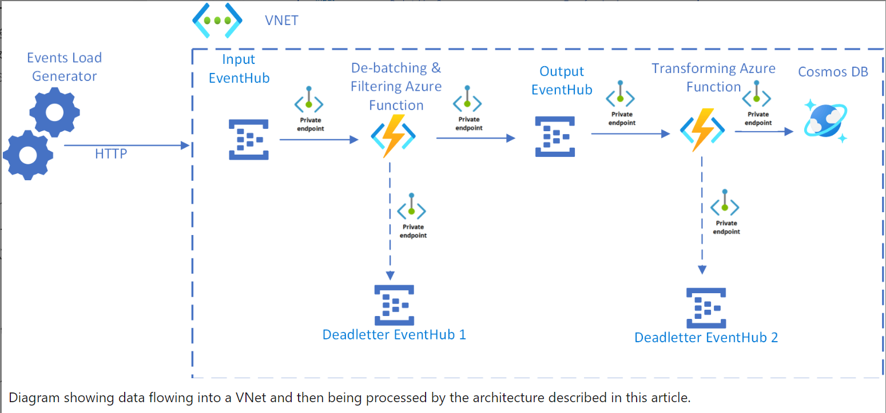
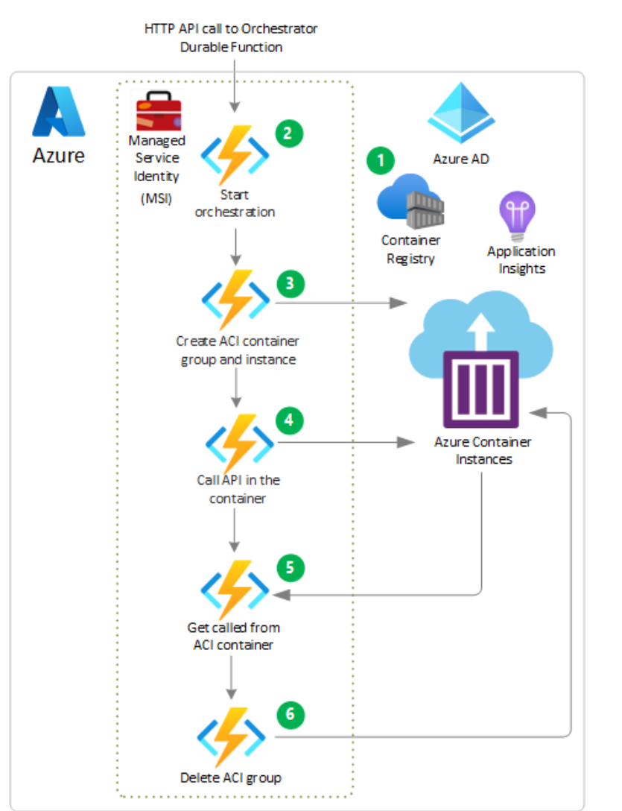
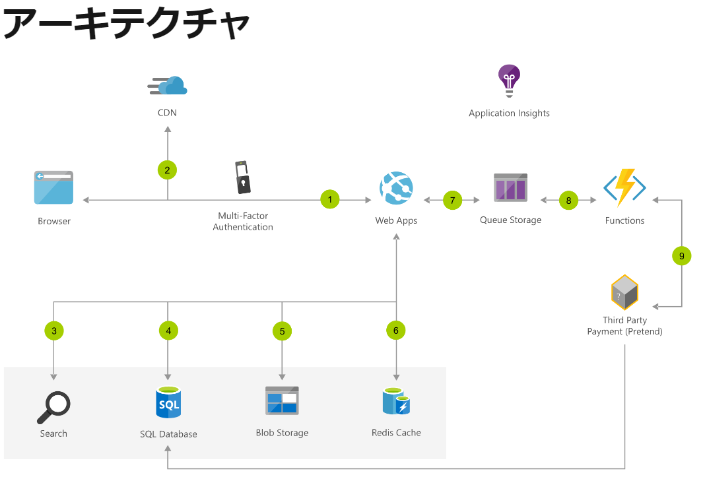
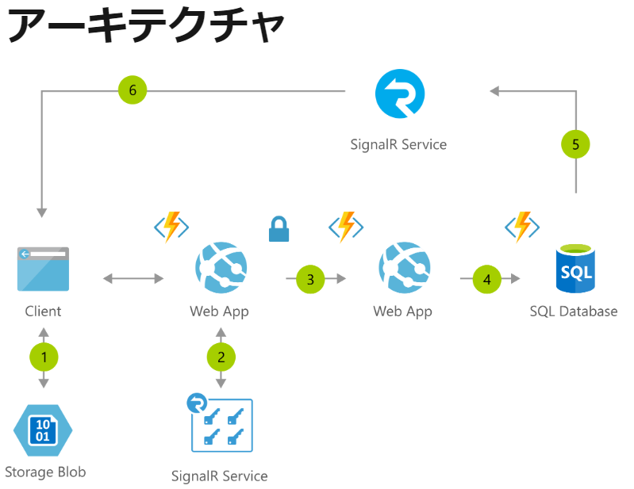
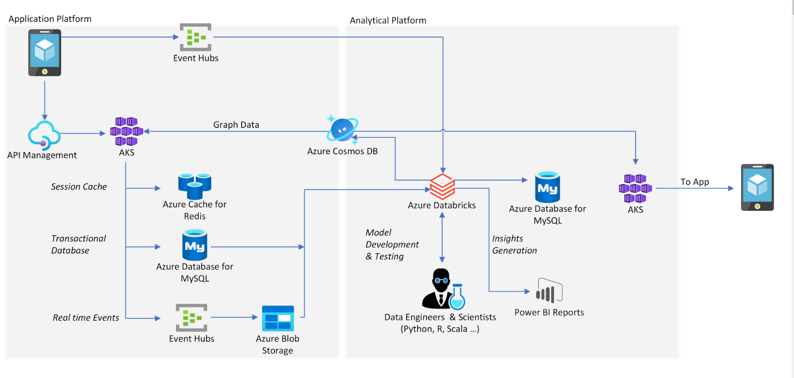
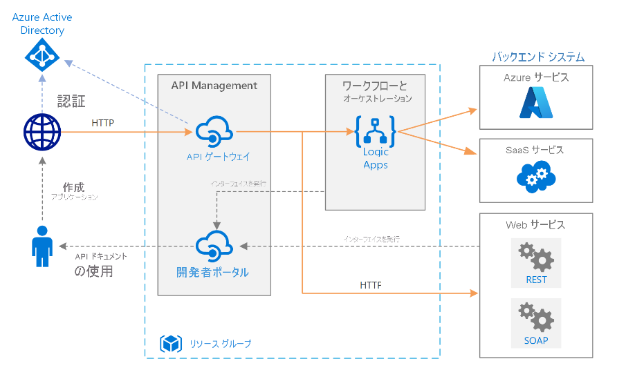

# Azure アーキテクチャを参照する

https://docs.microsoft.com/ja-jp/azure/architecture/browse/

## リファレンス アーキテクチャとは
アーキテクチャを設計する上で参考にできる資料。設計時に参考にできる資料という位置づけでありこれを厳守しなければならないわけではない。(※あくまでも参考）

※`参照アーキテクチャ`という言葉は以前からあった。

Azureでは、「Azure 上での一般的なワークロードに関するソリューションのアイデアを紹介します。」と説明されています。具体的なアーキテクチャとユースケースが示されており設計時に参考にすることで、Azureでのベストプラクティスなどを取り込むことができる。

参考にできそうなアーキテクチャをいくつか紹介します。

# サーバレスWEBアプリケーション

https://docs.microsoft.com/ja-jp/azure/architecture/reference-architectures/serverless/web-app

## 構成
・Azure CDNを使ったコンテンツの配信  
・Blobストレージに静的コンテンツをホスティング  
・API Managementを利用したAPI管理  
・Functions  
・ストレージにはCosmosDB  
・認証・認可にはAAD  

## まとめ
WEBアプリの基本的な構成。ほとんどのWEBアプリはこれで対応できる構成。
基本的なスケーラビリティも確保された構成。

# プライベートエンドポイントを持つサーバレスイベントストリーム

https://docs.microsoft.com/ja-jp/azure/architecture/solution-ideas/articles/serverless-event-processing-private-link

## 構成
EventHub(Queue)とFunctionsを組み合わせたイベント処理。過去のプロジェクトで実際に利用したことのある構成。サーバレスなベンド処理の基本的な構成。

## まとめ
Functionsのバインディングを利用することで簡単に実装できる。
スケーラビリティが確保された基本的ないベンドドリブン構成。DBにはRDBではなくNoSQLを利用した方がスケーラビリティを確保できる。

# Durable Functions を使用したサーバーレス バッチ処理

https://docs.microsoft.com/ja-jp/azure/architecture/solution-ideas/articles/durable-functions-containers

## 構成
Functions(Durable Functions)とACI(Azure Container Instance)を利用したバッチ処理。

## まとめ
Durable Functionsの具体的な例。時間のかかるバッチ処理に対応する場合の参考にできる。
コンピューターのリソースがたくさん必要な処理や時間のかかる処理をコンテナで(Azure Container Instance)実行する。

# スケーラブルな eコマース Web アプリの構築
https://docs.microsoft.com/ja-jp/azure/architecture/solution-ideas/articles/scalable-ecommerce-web-app

## 構成
## まとめ

# サーバーレス コードを使用したインスタント ブロードキャスト
https://docs.microsoft.com/ja-jp/azure/architecture/solution-ideas/articles/instant-broadcasting-on-serverless-architecture

## まとめ
一対多のリアルタイム通信と更新を簡素化する例として挙げられている。
IoTのデータ処理などに利用可能となっているが、図に示されているAppServiceとFunctionsの役割がよくわからない。
SignalRを使ったリアルタイム双方向通信の例として参考にできる。SignalR以外にもAzure PubSub(Websocket)やIoT(Mqtt)を使うことも可能。

# MySQL(RDB)とRedisを利用したWEB (AKS)
Web アプリケーションとモバイル アプリケーションを構築する

https://docs.microsoft.com/ja-jp/azure/architecture/solution-ideas/articles/webapps

インターネット規模のユーザーへの対応

## まとめ
「インターネット規模のユーザーへの対応」ということでEvent Hubs, AKSを利用してスケーラビリティを確保している。
HSBC のデジタル決済プラットフォームである PayMe for Business から着想を得ている。

※動画みるとプレビュー機能も利用している

# Azure での基本的なエンタープライズ統合

https://docs.microsoft.com/ja-jp/azure/architecture/reference-architectures/enterprise-integration/basic-enterprise-integration

AzureのiPaaSであるLogic Appを利用したシステム間連携の例

## まとめ
Azure AD + API Management の組み合わせでAPIの認証・認可を行うこの構成はAzureではよく利用される構成。
ワークフローの実現にLogic Appを利用して「ノーコード、ローコード」でシステム間の連携を実現できる。
プログラミングに抵抗がなければワークフローの実現にはFunctions(Durable Functions)の利用も検討できる。
Logic Appはすでに用意されている多数のコネクタが魅力。プログラミングなしなので品質は安定する。
