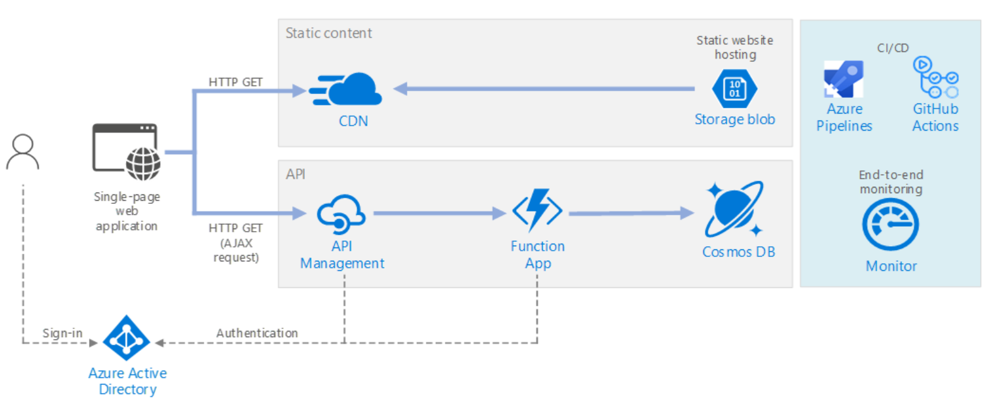

# Azure アーキテクチャを参照する

https://docs.microsoft.com/ja-jp/azure/architecture/browse/
の中から参考にできそうなアーキテクチャをピックアップ

それぞれのサービスの利用方法を習得してしまえば、あとは組み合わせて要件を満たすアーキテクチャが実現できる。

# サーバレスWEBアプリケーション

https://docs.microsoft.com/ja-jp/azure/architecture/reference-architectures/serverless/web-app

## 構成
・Azure CDNを使ったコンテンツの配信  
・Blobストレージに静的コンテンツをホスティング  
・API Managementを利用したAPI管理  
・Functions  
・ストレージにはCosmosDB  
・認証・認可にはAAD  

## まとめ
WEBアプリの基本的な構成。ほとんどのWEBアプリはこれで対応できる構成。
基本的なスケーラビリティも確保された構成。

# プライベートエンドポイントを持つサーバレスイベントストリーム

https://docs.microsoft.com/ja-jp/azure/architecture/solution-ideas/articles/serverless-event-processing-private-link

## 構成
EventHub(Queue)とFunctionsを組み合わせたイベント処理。過去のプロジェクトで実際に利用したことのある構成。サーバレスなベンド処理の基本的な構成。

## まとめ
Functionsのバインディングを利用することで簡単に実装できる。
スケーラビリティが確保された基本的ないベンドドリブン構成。DBにはRDBではなくNoSQLを利用した方がスケーラビリティを確保できる。

# Durable Functions を使用したサーバーレス バッチ処理

https://docs.microsoft.com/ja-jp/azure/architecture/solution-ideas/articles/durable-functions-containers

## 構成
Functions(Durable Functions)とACI(Azure Container Instance)を利用したバッチ処理。

## まとめ
Durable Functionsの具体的な例。時間のかかるバッチ処理に対応する場合の参考にできる。

# スケーラブルな eコマース Web アプリの構築
https://docs.microsoft.com/ja-jp/azure/architecture/solution-ideas/articles/scalable-ecommerce-web-app

# サーバーレス コードを使用したインスタント ブロードキャスト
https://docs.microsoft.com/ja-jp/azure/architecture/solution-ideas/articles/instant-broadcasting-on-serverless-architecture